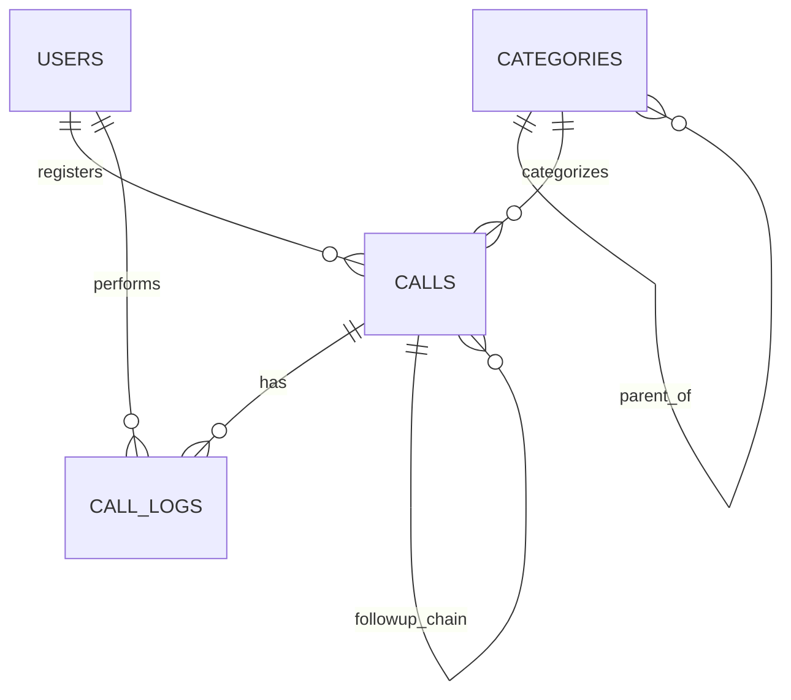

# Design Document

## Overview

Micro CRM شیپور یک اپلیکیشن Full-stack است که با استفاده از Next.js 16 (App Router + Turbopack + React 19) به‌عنوان فریم‌ورک فول‌استک، PostgreSQL 17 به‌عنوان دیتابیس، و Prisma 7 به‌عنوان ORM ساخته می‌شود. سیستم از Docker Compose برای استقرار استفاده می‌کند. تمامی وابستگی‌ها از آخرین نسخه پایدار و امن استفاده می‌کنند.

### Technology Stack

| Layer | Technology | Version | Rationale |
|-------|-----------|---------|-----------|
| Framework | Next.js (App Router, Turbopack) | 16.x | Full-stack, SSR/RSC, React 19, Turbopack default, production-ready |
| Language | TypeScript | 5.x | Type safety, better DX |
| Runtime | React | 19.x | Server Components, Suspense, streaming |
| Database | PostgreSQL | 17 | Latest stable, robust, concurrent access, JSON support |
| ORM | Prisma | 7.x | Rust-free TypeScript runtime, 3x faster queries, type-safe migrations |
| Auth | Auth.js (formerly NextAuth) | 5.x | Stable since 2024, JWT sessions, middleware protection, Next.js 16 native |
| UI Library | Tailwind CSS + shadcn/ui | 4.x | Rust-powered engine, CSS-native config, RTL support |
| Charts | Recharts | latest | React-native charting, RTL compatible |
| Jalali Calendar | jalaali-js + custom date picker | latest | Persian calendar conversion |
| Containerization | Docker + Docker Compose | latest | Single-command deployment |
| State Management | React Server Components + TanStack Query | 5.x | Server-first with client caching |
| Validation | Zod | latest | Runtime type validation, shared client/server schemas |
| Testing | Vitest + fast-check + Playwright | latest | Unit, property-based, and E2E testing |

## Architecture

```
┌─────────────────────────────────────────────────────────┐
│                    Docker Compose                         │
├─────────────────────────────────────────────────────────┤
│                                                          │
│  ┌──────────────────┐    ┌──────────────────────────┐   │
│  │   PostgreSQL 17   │◄───│   Next.js 16 App Server   │   │
│  │    (port 5432)    │    │       (port 3000)         │   │
│  └──────────────────┘    ├──────────────────────────┤   │
│                           │  - App Router (SSR/RSC)   │   │
│                           │  - Route Handlers (/api)  │   │
│                           │  - Auth.js v5             │   │
│                           │  - Prisma 7              │   │
│                           │  - Turbopack (bundler)    │   │
│                           └──────────────────────────┘   │
│                                                          │
└─────────────────────────────────────────────────────────┘
```

### Key Design Decisions

1. **Request ID Generation**: The Request_ID (format: YYMMDDNNN) is generated server-side using a database sequence per Jalali date. A transaction ensures uniqueness.
2. **Follow-Up Chain Model**: Follow-ups are modeled as a linked list with a root reference (`followup_root_id`, `linked_to_id`, `closed_by_call_id`).
3. **Category Denormalization**: Category names stored directly on Call_Records in addition to FK references for historical accuracy.
4. **Jalali Calendar**: All date inputs/outputs use Jalali calendar. Storage uses Gregorian DATE type with conversion at the application boundary using `jalaali-js`.
5. **Authentication Flow**: Auth.js v5 with Credentials provider, bcrypt hashing, JWT sessions in HTTP-only cookies, middleware-protected routes.
6. **RTL and Localization**: Root `<html dir="rtl" lang="fa">`, Tailwind CSS 4 with logical properties (start/end), all text in Persian, Vazirmatn font loaded locally.

## Components and Interfaces

### API Routes

#### Authentication
- `POST /api/auth/signin` - Login with credentials
- `POST /api/auth/signout` - Logout and terminate session
- `POST /api/users/bootstrap` - First-time admin creation

#### Calls
- `GET /api/calls` - List with filters and pagination
- `POST /api/calls` - Create new call record
- `GET /api/calls/:id` - Get single call
- `PUT /api/calls/:id` - Update call record
- `DELETE /api/calls/:id` - Delete call record
- `GET /api/calls/:id/logs` - Get change log history
- `GET /api/calls/export` - Export filtered calls as CSV
- `GET /api/request-id` - Generate next request ID for a date

#### Categories
- `GET /api/categories` - List all categories (tree structure)
- `POST /api/categories` - Create category
- `PUT /api/categories/:id` - Update category
- `DELETE /api/categories/:id` - Delete category
- `POST /api/categories/import` - Bulk import (merge/replace modes)

#### Customers
- `GET /api/customers?phone=&name=&requestId=` - Search and profile

#### Dashboard & Performance
- `GET /api/dashboard` - Dashboard stats with filters
- `GET /api/performance` - User performance data with filters

#### Users
- `GET /api/users` - List users
- `POST /api/users` - Create user
- `PUT /api/users/:id` - Update user
- `DELETE /api/users/:id` - Delete user

### UI Components

#### Layout Components
| Component | Purpose |
|-----------|---------|
| `Sidebar` | Navigation with role-based menu visibility, today's stats widget |
| `Topbar` | Page title, Jalali date/time, user pill, theme toggle, logout |
| `ThemeToggle` | Dark/light mode switch with localStorage persistence |

#### Call Components
| Component | Purpose |
|-----------|---------|
| `CallForm` | Registration/edit form with all fields and validation |
| `CallsTable` | Paginated table with sortable columns |
| `FollowUpAlert` | Shows open follow-ups when phone has existing chains |
| `CallLogPanel` | Displays audit trail for a call record |

#### Filter Components
| Component | Purpose |
|-----------|---------|
| `JalaliDatePicker` | Jalali calendar picker with month/year navigation |
| `DateRangePicker` | From/to date selection with quick presets |
| `MultiSelect` | Multi-select dropdown for agent/resolver filters |
| `QuickFilters` | Preset filter buttons (Today, Yesterday, etc.) |

#### Dashboard Components
| Component | Purpose |
|-----------|---------|
| `StatCards` | Summary statistics cards |
| `TrendChart` | Daily trend line chart (Recharts) |
| `CategoryChart` | Top categories bar chart |
| `StatusDonut` | Status distribution donut chart |

#### Shared Components
| Component | Purpose |
|-----------|---------|
| `ConfirmModal` | Confirmation dialog for destructive actions |
| `Toast` | Toast notifications (success/error/warning) |
| `Pagination` | Paginated navigation with configurable page size |
| `ExportButton` | CSV export trigger |

### Key Interfaces (TypeScript)

```typescript
interface CallRecord {
  id: string;
  requestId: string;
  date: Date;
  phone: string;
  customerName?: string;
  status: 'in_progress' | 'resolved';
  description?: string;
  categoryId: string;
  categoryName: string;
  subCategoryId?: string;
  subCategoryName?: string;
  subSubCategoryId?: string;
  subSubCategoryName?: string;
  agentId: string;
  agentName: string;
  followupRootId?: string;
  linkedToId?: string;
  closedByCallId?: string;
  resolvedById?: string;
  resolvedByName?: string;
  resolvedAt?: Date;
  createdAt: Date;
  updatedAt: Date;
}

interface CallFilter {
  dateFrom?: string;
  dateTo?: string;
  categoryId?: string;
  status?: string;
  agentIds?: string[];
  resolverIds?: string[];
  phone?: string;
  requestId?: string;
  search?: string;
  shift?: 'day' | 'evening' | 'night';
  followUpAge?: number;
  page?: number;
  pageSize?: number;
}

interface User {
  id: string;
  username: string;
  displayName: string;
  role: 'admin' | 'agent';
  isActive: boolean;
  createdAt: Date;
  updatedAt: Date;
}

interface Category {
  id: string;
  name: string;
  parentId?: string;
  level: 1 | 2 | 3;
  sortOrder: number;
  children?: Category[];
}

interface CallLog {
  id: string;
  callId: string;
  action: string;
  details: Record<string, { old: unknown; new: unknown }>;
  userId: string;
  userName: string;
  description?: string;
  createdAt: Date;
}
```

## Data Models

### Users Table
```sql
CREATE TABLE users (
  id            UUID PRIMARY KEY DEFAULT gen_random_uuid(),
  username      VARCHAR(100) UNIQUE NOT NULL,
  display_name  VARCHAR(200) NOT NULL,
  password_hash VARCHAR(255) NOT NULL,
  role          VARCHAR(20) NOT NULL CHECK (role IN ('admin', 'agent')),
  is_active     BOOLEAN DEFAULT true,
  created_at    TIMESTAMPTZ DEFAULT NOW(),
  updated_at    TIMESTAMPTZ DEFAULT NOW()
);
```

### Categories Table
```sql
CREATE TABLE categories (
  id         UUID PRIMARY KEY DEFAULT gen_random_uuid(),
  name       VARCHAR(200) NOT NULL,
  parent_id  UUID REFERENCES categories(id) ON DELETE SET NULL,
  level      INTEGER NOT NULL CHECK (level IN (1, 2, 3)),
  sort_order INTEGER DEFAULT 0,
  created_at TIMESTAMPTZ DEFAULT NOW()
);
CREATE INDEX idx_categories_parent ON categories(parent_id);
```

### Calls Table
```sql
CREATE TABLE calls (
  id                    UUID PRIMARY KEY DEFAULT gen_random_uuid(),
  request_id            VARCHAR(20) UNIQUE NOT NULL,
  date                  DATE NOT NULL,
  phone                 VARCHAR(11) NOT NULL,
  customer_name         VARCHAR(200),
  status                VARCHAR(30) NOT NULL CHECK (status IN ('in_progress', 'resolved')),
  description           TEXT,
  category_id           UUID REFERENCES categories(id),
  category_name         VARCHAR(200),
  sub_category_id       UUID REFERENCES categories(id),
  sub_category_name     VARCHAR(200),
  sub_sub_category_id   UUID REFERENCES categories(id),
  sub_sub_category_name VARCHAR(200),
  agent_id              UUID NOT NULL REFERENCES users(id),
  agent_name            VARCHAR(200) NOT NULL,
  followup_root_id      UUID REFERENCES calls(id),
  linked_to_id          UUID REFERENCES calls(id),
  closed_by_call_id     UUID REFERENCES calls(id),
  resolved_by_id        UUID REFERENCES users(id),
  resolved_by_name      VARCHAR(200),
  resolved_at           TIMESTAMPTZ,
  created_at            TIMESTAMPTZ DEFAULT NOW(),
  updated_at            TIMESTAMPTZ DEFAULT NOW()
);
CREATE INDEX idx_calls_phone ON calls(phone);
CREATE INDEX idx_calls_date ON calls(date);
CREATE INDEX idx_calls_agent ON calls(agent_id);
CREATE INDEX idx_calls_status ON calls(status);
CREATE INDEX idx_calls_followup_root ON calls(followup_root_id);
CREATE INDEX idx_calls_request_id ON calls(request_id);
```

### Call Logs Table
```sql
CREATE TABLE call_logs (
  id          UUID PRIMARY KEY DEFAULT gen_random_uuid(),
  call_id     UUID NOT NULL REFERENCES calls(id) ON DELETE CASCADE,
  action      VARCHAR(50) NOT NULL,
  details     JSONB,
  user_id     UUID NOT NULL REFERENCES users(id),
  user_name   VARCHAR(200) NOT NULL,
  description TEXT,
  created_at  TIMESTAMPTZ DEFAULT NOW()
);
CREATE INDEX idx_call_logs_call ON call_logs(call_id);
```

### Entity Relationships (Mermaid)



## Correctness Properties

*A property is a characteristic or behavior that should hold true across all valid executions of a system — essentially, a formal statement about what the system should do. Properties serve as the bridge between human-readable specifications and machine-verifiable correctness guarantees.*

### Property 1: Request_ID format validity

*For any* Jalali date and daily sequence number, the generated Request_ID SHALL match the format YYMMDDNNN where YY is the 2-digit Jalali year, MM is the zero-padded month, DD is the zero-padded day, and NNN is the zero-padded sequence number.

**Validates: Requirements 3.2**

### Property 2: Phone number validation

*For any* string input, phone validation SHALL pass if and only if the string is exactly 11 digits and starts with "09".

**Validates: Requirements 3.3**

### Property 3: Conditional customer name requirement

*For any* call form submission with status "در حال پیگیری" (in_progress), the system SHALL reject the submission if customer_name is empty or missing.

**Validates: Requirements 3.4**

### Property 4: Role-based route access control

*For any* protected route and any user, access SHALL be granted if and only if the user's role includes that route in its allowed set (Agent: calls, report, customer profile; Admin: all routes).

**Validates: Requirements 2.2, 2.3**

### Property 5: Ownership-based call modification permissions

*For any* user and any Call_Record, edit/delete SHALL be permitted if and only if the user is an Admin OR the user is the Agent who created that Call_Record.

**Validates: Requirements 2.4, 2.5**

### Property 6: Audit log completeness on modification

*For any* creation, update, status change, follow-up linkage, or deletion action on a Call_Record, the system SHALL append a log entry containing: action type, changed fields with old/new values, timestamp, and user identity.

**Validates: Requirements 3.8, 5.2, 14.1, 14.4**

### Property 7: Audit log immutability and chronological ordering

*For any* set of log entries for a Call_Record, (a) no log entry can be modified or deleted after creation, and (b) entries are always returned in chronological order by timestamp.

**Validates: Requirements 14.2, 14.3**

### Property 8: Follow-up chain linkage correctness

*For any* "continue follow-up" action, the new Call_Record's `followup_root_id` SHALL equal the root of the selected chain, and `linked_to_id` SHALL point to the last call in that chain. *For any* "new issue" action, the new Call_Record SHALL have a distinct `followup_root_id` not shared with any other chain for that phone.

**Validates: Requirements 4.2, 4.3**

### Property 9: Close all follow-ups atomicity

*For any* phone number with N open follow-ups, when "close previous follow-ups" is selected, all N records SHALL be marked resolved with correct resolver identity and timestamp.

**Validates: Requirements 4.4, 4.5**

### Property 10: Chain integrity preservation on deletion

*For any* Call_Record that is part of a Follow_Up_Chain, after deletion the remaining chain SHALL have valid `linked_to_id` references without gaps (the next call's `linked_to_id` is reassigned to the deleted call's predecessor).

**Validates: Requirements 5.4, 5.5**

### Property 11: Call data edit round-trip

*For any* Call_Record, when opened for editing, all field values displayed in the form SHALL equal the values stored in the database.

**Validates: Requirements 5.1**

### Property 12: Filter accuracy

*For any* set of filter criteria applied to Call_Records, all returned records SHALL match every active filter condition, and no matching record SHALL be excluded from results.

**Validates: Requirements 6.2, 7.4, 8.8, 9.5**

### Property 13: Pagination correctness

*For any* dataset of N records with page size P, page K SHALL contain exactly min(P, N - K*P) records starting at offset K*P, and the union of all pages equals the full filtered dataset.

**Validates: Requirements 6.1, 7.5**

### Property 14: CSV export completeness

*For any* filtered result set, the generated CSV SHALL contain one row per record with all field values matching the source data and correct Persian column headers.

**Validates: Requirements 6.4, 7.6, 9.6**

### Property 15: Customer summary accuracy

*For any* customer identified by phone number, the summary counts (total calls, open follow-ups, resolved, total chains) SHALL equal the actual counts computed from their Call_Records.

**Validates: Requirements 7.2**

### Property 16: Timeline grouping by chain

*For any* customer's call history, calls SHALL be grouped such that all calls sharing the same `followup_root_id` appear in the same group, and no call appears in more than one group.

**Validates: Requirements 7.3**

### Property 17: Dashboard aggregation accuracy

*For any* filtered set of calls, the stat card values (total, today's, in-progress, resolved) and daily trend data SHALL equal the correct aggregations computed from the filtered records.

**Validates: Requirements 8.2, 8.5**

### Property 18: Category hierarchy constraint

*For any* category in the tree, its level SHALL be exactly parent.level + 1 (or 1 if no parent), and no category SHALL exceed level 3.

**Validates: Requirements 10.2**

### Property 19: Bulk import mode correctness

*For any* existing category set and import data, merge mode SHALL preserve all existing categories while adding new ones, and replace mode SHALL result in exactly the imported categories.

**Validates: Requirements 10.5**

### Property 20: Category deletion preserves record names

*For any* Call_Record referencing a deleted category, the record's `category_name` (and sub-category names) SHALL remain unchanged after category deletion.

**Validates: Requirements 10.7**

### Property 21: Deactivated user login rejection

*For any* deactivated user account, authentication attempts with valid credentials SHALL be rejected.

**Validates: Requirements 11.6**

### Property 22: Jalali date conversion round-trip

*For any* valid Gregorian date stored in the database, converting to Jalali for display and back to Gregorian SHALL produce the original date.

**Validates: Requirements 12.2**

### Property 23: Invalid credentials generic error

*For any* invalid credential combination (wrong username, wrong password, or both), the authentication error message SHALL be identical and not reveal which field is incorrect.

**Validates: Requirements 1.2**

## Error Handling

### API Error Responses

All API endpoints return structured error responses:

```typescript
interface ApiError {
  error: string;       // Machine-readable error code
  message: string;     // Persian user-facing message
  details?: unknown;   // Optional validation details
}
```

| HTTP Status | Scenario | User Message |
|-------------|----------|--------------|
| 400 | Validation failure | Specific field errors in Persian |
| 401 | Not authenticated | "لطفاً وارد شوید" |
| 403 | Insufficient permissions | "شما اجازه دسترسی به این بخش را ندارید" |
| 404 | Resource not found | "مورد درخواستی یافت نشد" |
| 409 | Conflict (duplicate) | "این مورد قبلاً ثبت شده است" |
| 500 | Internal server error | "خطای سرور، لطفاً دوباره تلاش کنید" |

### Client-Side Error Handling

- **Network errors**: Toast notification with retry suggestion
- **Validation errors**: Inline field-level error messages in Persian
- **Session expiry**: Redirect to login page with return URL
- **Database connection loss**: Full-page error state with auto-retry

### Input Validation Strategy

All inputs validated at two levels:
1. **Client-side**: Real-time feedback using Zod schemas (same schemas shared with server)
2. **Server-side**: Mandatory validation in API routes before any database operation

Key validation rules:
- Phone: exactly 11 digits, starts with "09"
- Customer name: required when status is "در حال پیگیری"
- Category: at least level 1 required for all calls
- Password: minimum 6 characters
- Username: unique, no special characters

### Database Error Handling

- **Unique constraint violations**: Mapped to 409 with Persian message
- **Foreign key violations**: Mapped to 400 with reference error
- **Connection pool exhaustion**: Logged, user sees 503 with retry
- **Transaction failures**: Automatic retry up to 3 times for serialization conflicts

## Testing Strategy

### Dual Testing Approach

This feature uses both unit tests and property-based tests for comprehensive coverage.

#### Property-Based Testing

- **Library**: [fast-check](https://github.com/dubzzz/fast-check) (TypeScript PBT library)
- **Minimum iterations**: 100 per property test
- **Tag format**: `Feature: micro-crm, Property {number}: {property_text}`

Property tests cover the 23 correctness properties defined above, focusing on:
- Input validation logic (phone, conditional fields, Request_ID format)
- Permission and access control logic
- Data transformation (Jalali conversion, CSV export, aggregation)
- Chain integrity invariants (follow-up links, deletion)
- Filter and pagination correctness

#### Unit Tests (Example-Based)

Unit tests cover specific scenarios and edge cases:
- Bootstrap flow (no users → first admin creation)
- Session behavior (remember me, expiry, logout)
- Quick filter presets (correct date ranges)
- UI component rendering (table columns, modals, toasts)
- CRUD operations for categories and users

#### Integration Tests

Integration tests verify end-to-end flows:
- Full call lifecycle: create → edit → follow-up → resolve
- Concurrent user access without data conflicts
- Docker deployment smoke test
- Database connection loss and recovery

### Test Organization

```
tests/
├── unit/
│   ├── auth/
│   ├── calls/
│   ├── categories/
│   ├── customers/
│   └── users/
├── properties/
│   ├── validation.property.test.ts
│   ├── permissions.property.test.ts
│   ├── audit-log.property.test.ts
│   ├── followup-chain.property.test.ts
│   ├── filters.property.test.ts
│   ├── pagination.property.test.ts
│   ├── csv-export.property.test.ts
│   ├── aggregation.property.test.ts
│   ├── categories.property.test.ts
│   └── jalali.property.test.ts
└── integration/
    ├── call-lifecycle.test.ts
    ├── concurrent-access.test.ts
    └── deployment.test.ts
```

### Security Considerations

1. **Input Validation**: All API inputs validated with Zod schemas (shared client/server)
2. **SQL Injection**: Prevented by Prisma 7 parameterized queries
3. **XSS**: React 19's default escaping + CSP headers
4. **CSRF**: Auth.js v5 built-in CSRF tokens
5. **Rate Limiting**: Applied to login endpoint (5 attempts/minute per IP)
6. **Password Policy**: Minimum 6 characters, bcrypt hashing (12 rounds)
7. **Security Headers**: Strict headers via next.config.ts (X-Frame-Options, X-Content-Type-Options, Referrer-Policy, HSTS)
8. **Dependency Security**: All packages pinned to exact versions, automated vulnerability scanning via `npm audit`
9. **Session Security**: HTTP-only, Secure, SameSite=Lax cookies; JWT rotation on sensitive operations

### Performance Considerations

1. **Database Indexes**: On all frequently queried columns (phone, date, agent_id, status, request_id)
2. **Server Components**: Default to RSC for zero client-JS initial load (React 19)
3. **Turbopack**: Default bundler in Next.js 16 for 5x faster builds and instant HMR
4. **Pagination**: All list views paginated server-side
5. **Connection Pooling**: Prisma 7 connection pool configured for Docker environment
6. **Static Assets**: Font files served locally, Tailwind CSS 4 purges unused styles automatically
7. **Streaming**: React 19 Suspense boundaries for progressive loading of dashboard charts

## Directory Structure

```
micro-crm/
├── docker-compose.yml
├── Dockerfile
├── .env.example
├── package.json
├── tsconfig.json
├── tailwind.config.ts
├── next.config.ts
├── prisma/
│   ├── schema.prisma
│   ├── migrations/
│   └── seed.ts
├── src/
│   ├── app/
│   │   ├── layout.tsx
│   │   ├── page.tsx
│   │   ├── login/page.tsx
│   │   ├── (authenticated)/
│   │   │   ├── layout.tsx
│   │   │   ├── calls/
│   │   │   ├── customers/
│   │   │   ├── dashboard/
│   │   │   ├── performance/
│   │   │   ├── settings/
│   │   │   └── account/
│   │   └── api/
│   │       ├── auth/[...nextauth]/route.ts  # Auth.js v5 handler
│   │       ├── calls/
│   │       ├── categories/
│   │       ├── customers/
│   │       ├── dashboard/
│   │       ├── performance/
│   │       ├── users/
│   │       └── request-id/
│   ├── components/
│   │   ├── ui/
│   │   ├── layout/
│   │   ├── calls/
│   │   ├── customers/
│   │   ├── dashboard/
│   │   ├── filters/
│   │   └── shared/
│   ├── lib/
│   │   ├── prisma.ts
│   │   ├── auth.ts
│   │   ├── jalali.ts
│   │   ├── request-id.ts
│   │   ├── csv-export.ts
│   │   └── validators.ts
│   ├── hooks/
│   └── types/
└── public/fonts/
```
