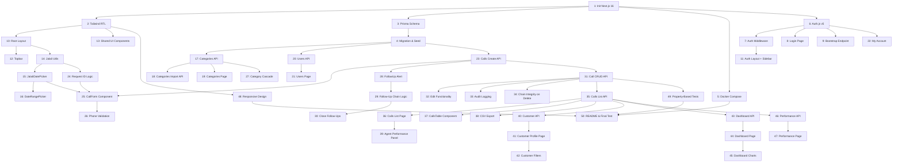

# Implementation Plan: Micro CRM

## Overview

Enterprise-level Call Center CRM for Sheypoor built with Next.js 16 (React 19, Turbopack), PostgreSQL 17, Prisma 7, Auth.js v5, Tailwind CSS 4, and Docker Compose. All dependencies use latest stable versions with security best practices. Replaces the existing HTML/Google Sheets prototype with a production-ready full-stack application supporting concurrent multi-user access, Jalali calendar, RTL Persian UI, and comprehensive reporting.

## Tasks

- [x] 1. Initialize Next.js 16 project with TypeScript, Tailwind CSS 4, App Router, and Turbopack configuration
  - Requirements: 12, 13
  - Files: package.json, tsconfig.json, next.config.ts, tailwind.config.ts, .env.example
- [x] 2. Configure Tailwind CSS 4 for RTL support with Vazirmatn font and Persian-first design tokens matching existing UI colors
  - Requirements: 12
  - Files: tailwind.config.ts, src/app/globals.css, public/fonts/*
- [x] 3. Set up Prisma 7 ORM with PostgreSQL 17 connection and create schema with all tables (users, categories, calls, call_logs) and relations
  - Requirements: 13, 14
  - Files: prisma/schema.prisma, src/lib/prisma.ts
- [x] 4. Create initial Prisma migration and seed script with default categories and bootstrap check
  - Requirements: 10, 13
  - Files: prisma/migrations/*, prisma/seed.ts
- [x] 5. Create Docker Compose configuration (Next.js 16 app + PostgreSQL 17) and multi-stage Dockerfile for production build
  - Requirements: 13
  - Files: docker-compose.yml, docker-compose.dev.yml, Dockerfile
- [x] 6. Install and configure Auth.js v5 (NextAuth v5) with Credentials provider, JWT strategy, and role-based session callbacks
  - Requirements: 1, 2
  - Files: src/lib/auth.ts, src/app/api/auth/[...nextauth]/route.ts
- [x] 7. Create auth middleware to protect /(authenticated)/ routes and enforce role-based access
  - Requirements: 2
  - Files: src/middleware.ts
- [x] 8. Create login page with Persian UI, RTL layout, username/password fields, remember-me checkbox, and bootstrap detection
  - Requirements: 1
  - Files: src/app/login/page.tsx
- [x] 9. Create bootstrap endpoint (POST /api/users/bootstrap) for first-time admin account creation with bcrypt hashing
  - Requirements: 1
  - Files: src/app/api/users/bootstrap/route.ts
- [x] 10. Create root layout with RTL direction, Vazirmatn font, and dark/light mode CSS variable support
  - Requirements: 12
  - Files: src/app/layout.tsx
- [x] 11. Create authenticated layout with sidebar navigation matching existing tab structure and role-based menu visibility
  - Requirements: 2, 12
  - Files: src/app/(authenticated)/layout.tsx, src/components/layout/Sidebar.tsx
- [x] 12. Build Topbar component with page title, live Jalali date/time display, user pill, theme toggle, and logout button
  - Requirements: 12
  - Files: src/components/layout/Topbar.tsx, src/components/layout/ThemeToggle.tsx
- [x] 13. Create shared UI components: ConfirmModal, Toast notifications, and Pagination with shadcn/ui base
  - Requirements: 12
  - Files: src/components/shared/ConfirmModal.tsx, src/components/shared/Toast.tsx, src/components/shared/Pagination.tsx
- [x] 14. Create Jalali date utility library with conversion, formatting, day-of-week, and month name functions
  - Requirements: 12
  - Files: src/lib/jalali.ts, src/hooks/useJalaliDate.ts
- [x] 15. Build JalaliDatePicker component with month/year navigation, day grid, today highlight, and RTL layout
  - Requirements: 3, 12
  - Files: src/components/filters/JalaliDatePicker.tsx
- [x] 16. Build DateRangePicker component with from/to date selection and quick filter presets
  - Requirements: 6, 8
  - Files: src/components/filters/DateRangePicker.tsx, src/components/filters/QuickFilters.tsx
- [x] 17. Create categories API routes: GET (tree), POST (create), PUT (update), DELETE (delete) with hierarchy validation
  - Requirements: 10
  - Files: src/app/api/categories/route.ts, src/app/api/categories/[id]/route.ts
- [x] 18. Create bulk import API route (POST /api/categories/import) with merge/replace modes
  - Requirements: 10
  - Files: src/app/api/categories/import/route.ts
- [x] 19. Build category management page with 3-level tree view, inline add/edit/delete, and import modal
  - Requirements: 10
  - Files: src/app/(authenticated)/settings/categories/page.tsx
- [x] 20. Create users API routes: GET (list), POST (create), PUT (update), DELETE (delete) with role validation
  - Requirements: 11
  - Files: src/app/api/users/route.ts, src/app/api/users/[id]/route.ts
- [x] 21. Build user management page with table display and add/edit user modal with form validation
  - Requirements: 11
  - Files: src/app/(authenticated)/settings/users/page.tsx
- [x] 22. Create My Account page for password change accessible by all roles
  - Requirements: 11
  - Files: src/app/(authenticated)/account/page.tsx
- [x] 23. Create calls API route: POST /api/calls with Zod validation (phone 11-digit, required fields, category, auto-generated Request_ID)
  - Requirements: 3
  - Files: src/app/api/calls/route.ts, src/lib/validators.ts
- [x] 24. Implement Request ID generation logic (YYMMDDNNN format) with database transaction for uniqueness
  - Requirements: 3
  - Files: src/lib/request-id.ts, src/app/api/request-id/route.ts
- [x] 25. Build CallForm component with all fields: Jalali date picker, phone, customer name, status, 3-level category cascade, description
  - Requirements: 3
  - Files: src/components/calls/CallForm.tsx, src/app/(authenticated)/calls/new/page.tsx
- [x] 26. Implement phone validation (11 digits starting with 09) with real-time feedback and auto-lookup of existing customer name
  - Requirements: 3
  - Files: src/components/calls/CallForm.tsx, src/lib/validators.ts
- [x] 27. Build 3-level category cascade selector (category → subcategory → sub-subcategory) with dependent dropdowns
  - Requirements: 3
  - Files: src/components/calls/CategoryCascade.tsx
- [x] 28. Create API endpoint to check open follow-ups by phone number and build FollowUpAlert component
  - Requirements: 4
  - Files: src/components/calls/FollowUpAlert.tsx
- [x] 29. Implement follow-up chain logic: continue existing chain (link via followup_root_id/linked_to_id) and new issue (separate chain)
  - Requirements: 4
  - Files: src/app/api/calls/route.ts
- [x] 30. Implement close previous follow-ups logic (mark all open follow-ups as resolved, record closer identity)
  - Requirements: 4
  - Files: src/app/api/calls/route.ts
- [x] 31. Create call API routes: GET /api/calls/[id], PUT, DELETE with permission checks (Agent own-only, Admin all)
  - Requirements: 5, 2
  - Files: src/app/api/calls/[id]/route.ts
- [x] 32. Implement edit functionality: populate form, show editing badge, show request ID and change log panel
  - Requirements: 5
  - Files: src/components/calls/CallForm.tsx, src/components/calls/CallLogPanel.tsx
- [x] 33. Implement audit logging on all call mutations (create, update, status change, delete) with user identity and timestamp
  - Requirements: 14
  - Files: src/app/api/calls/[id]/logs/route.ts
- [x] 34. Implement chain integrity maintenance on deletion (reassign linked_to_id to maintain chain continuity)
  - Requirements: 5
  - Files: src/app/api/calls/[id]/route.ts
- [x] 35. Create calls list API with full filter support (date range, category, status, agent, resolver, phone, request_id, text search, shift, follow-up age)
  - Requirements: 6
  - Files: src/app/api/calls/route.ts
- [x] 36. Build calls list page with filter panel, quick filters, MultiSelect for agent/resolver, and general text search
  - Requirements: 6
  - Files: src/app/(authenticated)/calls/page.tsx, src/components/filters/MultiSelect.tsx
- [x] 37. Build CallsTable component with columns (Date, Time, Request_ID, Phone, Category, Agent, Resolver, Status, Description, Actions) and pagination
  - Requirements: 6
  - Files: src/components/calls/CallsTable.tsx
- [x] 38. Implement CSV export for filtered call results with proper Persian column headers
  - Requirements: 6
  - Files: src/app/api/calls/export/route.ts, src/lib/csv-export.ts
- [x] 39. Build agent performance panel (visible to Agent role) showing personal stats and status donut chart
  - Requirements: 6
  - Files: src/components/calls/AgentPerformancePanel.tsx
- [x] 40. Create customer profile API (GET /api/customers) with search by phone, request_id, name and profile data aggregation
  - Requirements: 7
  - Files: src/app/api/customers/route.ts
- [x] 41. Build customer profile page with search interface, summary card, and timeline view grouped by follow-up chains
  - Requirements: 7
  - Files: src/app/(authenticated)/customers/page.tsx, src/components/customers/CustomerTimeline.tsx
- [x] 42. Implement customer profile filters (date range, category, status, sort, open-only toggle) with pagination and CSV export
  - Requirements: 7
  - Files: src/components/customers/CustomerSearch.tsx
- [x] 43. Create dashboard API (GET /api/dashboard) with aggregated stats, chart data, frequent callers, and filter support
  - Requirements: 8
  - Files: src/app/api/dashboard/route.ts
- [x] 44. Build dashboard page with stat cards, filter panel, frequent callers panel, and open follow-up age display
  - Requirements: 8
  - Files: src/app/(authenticated)/dashboard/page.tsx, src/components/dashboard/StatCards.tsx
- [x] 45. Build dashboard charts: daily trend line chart, top categories bar chart, status distribution donut chart using Recharts
  - Requirements: 8
  - Files: src/components/dashboard/TrendChart.tsx, src/components/dashboard/CategoryChart.tsx, src/components/dashboard/StatusDonut.tsx
- [x] 46. Create performance API (GET /api/performance) with user stats aggregation, rankings, and filter support
  - Requirements: 9
  - Files: src/app/api/performance/route.ts
- [x] 47. Build performance page with summary stats, ranking bar charts, detailed table, and CSV export
  - Requirements: 9
  - Files: src/app/(authenticated)/performance/page.tsx
- [x] 48. Add responsive design breakpoints for mobile (320px) to wide screens (2560px) and verify RTL layout consistency
  - Requirements: 12
  - Files: src/app/globals.css, various component files
- [x] 49. Write property-based tests for correctness properties (Request_ID uniqueness, chain integrity, access control, phone validation, status constraints)
  - Requirements: 3, 4, 5, 14
  - Files: tests/unit/*, tests/integration/*
- [x] 50. Create README with setup instructions, environment variables, Docker deployment guide, and run full integration test
  - Requirements: 13
  - Files: README.md

## Task Dependency Graph



```json
{
  "waves": [
    {"tasks": [1]},
    {"tasks": [2, 3, 5, 6]},
    {"tasks": [4, 7, 8, 9, 10]},
    {"tasks": [11, 12, 13, 14]},
    {"tasks": [15, 17, 20, 22, 23]},
    {"tasks": [16, 18, 19, 21, 24, 25]},
    {"tasks": [26, 27, 28, 31]},
    {"tasks": [29, 30, 32, 33, 34, 35]},
    {"tasks": [36, 37, 38, 39, 40, 43, 46]},
    {"tasks": [41, 42, 44, 47]},
    {"tasks": [45, 48, 49]},
    {"tasks": [50]}
  ]
}
```

## Notes

- All dependencies pinned to latest stable versions for security (Next.js 16, React 19, Prisma 7, Auth.js v5, Tailwind CSS 4, PostgreSQL 17)
- All dates stored as Gregorian in PostgreSQL, converted to/from Jalali at application boundary
- Category names denormalized on Call records for historical accuracy
- Auth.js v5 used for Next.js 16 + React 19 compatibility (stable since late 2024)
- Turbopack is the default bundler in Next.js 16 for 5x faster builds
- Prisma 7 uses Rust-free TypeScript runtime with 3x faster queries and ~90% smaller bundles
- Tailwind CSS 4 uses Rust-powered engine with CSS-native configuration (no JS config file)
- Docker Compose deploys both app and database with a single command
- Property-based tests use fast-check library with Vitest runner
- All packages use exact version pinning in package.json for reproducible builds and security
