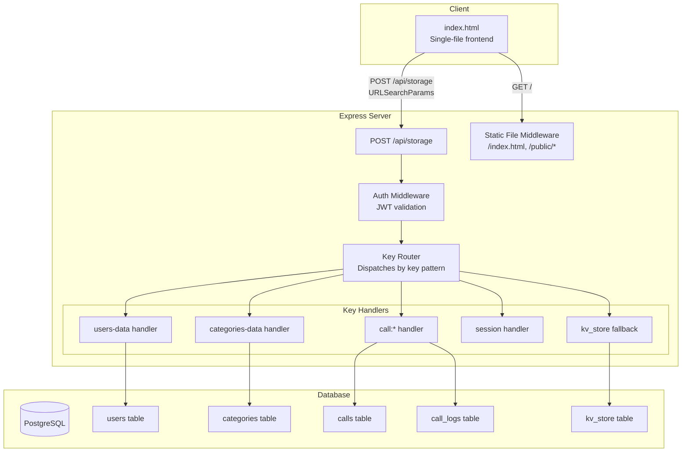

# Design Document: Node.js Backend

## Overview

This design describes a Node.js/TypeScript backend using Express that replaces the Google Apps Script + Google Sheets backend for the Micro-CRM application. The backend exposes a single `POST /api/storage` endpoint that accepts `application/x-www-form-urlencoded` bodies (matching the GAS contract exactly), serves `index.html` as a static file, and uses PostgreSQL via Prisma ORM for data persistence.

**Key architectural principle:** The frontend (`index.html`) is never modified. The backend must accept the exact same request format the frontend currently sends to Google Apps Script — a POST with URLSearchParams body containing `action`, `key`, `value`, and `prefix` fields — and return identical JSON response shapes.

### Design Goals

1. **Zero frontend changes** — only `GAS_URL` constant is swapped to point to the new backend
2. **GAS-compatible API** — same request/response contract for get, set, delete, list actions
3. **Server-side security** — bcrypt password hashing, JWT sessions, RBAC enforcement
4. **Simple deployment** — single Express process serving both static files and API, containerized with Docker
5. **Structured storage** — while the API surface is key-value, the backend uses relational tables (users, calls, categories) with a `kv_store` fallback for unrecognized keys

## Architecture



### Request Flow

1. Frontend sends `POST /api/storage` with `Content-Type: application/x-www-form-urlencoded`
2. Express parses the body (using `express.urlencoded()`)
3. The **Key Router** inspects the `action` + `key`/`prefix` combination to determine which handler processes the request:
   - `key = "users-data"` → Users handler
   - `key = "categories-data"` → Categories handler
   - `key` starts with `"call:"` → Calls handler
   - `key = "session"` → Returns null (session is LOCAL_ONLY in the frontend, never sent to server)
   - Everything else → Generic `kv_store` table
4. Auth middleware validates the JWT token from the `Authorization` header (except for login/register actions and health check)
5. RBAC middleware checks role-based permissions on sensitive operations

### Authentication Flow

The frontend currently handles auth client-side:
- Stores user data in `users-data` key (all users as JSON array)
- Hashes passwords with SHA-256 client-side
- Stores session in localStorage (LOCAL_ONLY, never sent to server)

**New flow with backend auth:**
- The backend intercepts `storageGet('users-data')` and `storageSet('users-data', ...)` to handle auth logic server-side
- Login is implemented as a dedicated `POST /api/auth/login` endpoint
- Registration during bootstrap mode: `POST /api/auth/register`
- The frontend will store the JWT token in localStorage and send it as `Authorization: Bearer <token>` header
- Password migration: on first login with SHA-256 hash, the backend verifies the hash and re-hashes with bcrypt

> **Note:** Since `session` is in `_LOCAL_ONLY_KEYS`, it's never sent to the GAS backend. The new auth flow uses JWT tokens instead, and the frontend must be configured to include the token in requests. Since we cannot modify `index.html`, the backend must also support a cookie-based session fallback where the JWT is set as an HttpOnly cookie on login and read from the cookie on subsequent requests.

**Revised approach:** Since `index.html` cannot be modified and currently uses `storageGet/storageSet` for session management entirely in localStorage, the auth flow must work differently:

1. The frontend calls `storageGet('users-data')` to get the user list and validates passwords client-side
2. The backend intercepts `storageSet('users-data', ...)` and `storageGet('users-data')` — it returns user data **without password hashes** to the frontend
3. A dedicated login endpoint (`POST /api/auth/login`) accepts username + password, validates server-side with bcrypt, and returns a session token
4. The session token is stored in a **secure HttpOnly cookie** set by the backend on successful login — this way, all subsequent `fetch` calls from the frontend automatically include it
5. The Storage API middleware reads the cookie to authenticate requests

This approach works because `fetch` with `redirect:'follow'` and same-origin will automatically include cookies. No `index.html` modifications needed.

## Components and Interfaces

### 1. Express Application (`server/app.ts`)

Entry point that configures middleware and mounts routes.

```typescript
// Middleware stack (in order):
// 1. express.urlencoded({ extended: false, limit: '1mb' })
// 2. express.json({ limit: '1mb' })
// 3. cookieParser()
// 4. CORS (same-origin only)
// 5. Rate limiter (on auth endpoints)
// 6. Static file serving (/, /public/*)
// 7. Health check route (GET /api/health)
// 8. Auth routes (POST /api/auth/login, POST /api/auth/register)
// 9. Auth middleware (validates cookie/token)
// 10. Storage API route (POST /api/storage)
```

### 2. Storage Router (`server/routes/storage.ts`)

Single endpoint that dispatches based on key patterns.

```typescript
interface StorageRequest {
  action: 'get' | 'set' | 'delete' | 'list';
  key?: string;
  value?: string;
  prefix?: string;
}

interface StorageResponse {
  value?: string | null;       // for 'get' action
  success?: boolean;           // for 'set' and 'delete' actions
  items?: { key: string; value: string }[]; // for 'list' action
  error?: string;              // for error responses
}
```

### 3. Auth Module (`server/routes/auth.ts`)

Handles login, registration, and session management.

```typescript
// POST /api/auth/login
interface LoginRequest {
  username: string;
  password: string;     // plaintext password OR SHA-256 hash (for migration)
}

interface LoginResponse {
  success: boolean;
  user?: { id: string; username: string; displayName: string; role: string };
  error?: string;
}

// POST /api/auth/register (bootstrap mode only)
interface RegisterRequest {
  username: string;
  displayName: string;
  password: string;
}
```

### 4. Key Handlers (`server/handlers/`)

Each handler implements the storage interface for its key domain:

| Handler | Keys | Logic |
|---------|------|-------|
| `users.handler.ts` | `users-data` | Returns sanitized user list (no hashes), handles user CRUD with RBAC |
| `categories.handler.ts` | `categories-data` | Persists/retrieves category tree, validates hierarchy |
| `calls.handler.ts` | `call:*` | Validates call records, enforces agent-scoped visibility, creates audit logs |
| `kv.handler.ts` | Everything else | Generic key-value CRUD against `kv_store` table |

### 5. Middleware (`server/middleware/`)

| Middleware | Responsibility |
|-----------|---------------|
| `auth.middleware.ts` | Validates JWT from cookie or Authorization header; attaches user to request |
| `rbac.middleware.ts` | Checks role-based permissions based on key + action |
| `rate-limit.middleware.ts` | Rate-limits auth endpoints (10 req/min/IP) |
| `validation.middleware.ts` | Validates request body with Zod; returns structured errors |

### 6. Health Check (`server/routes/health.ts`)

```typescript
// GET /api/health
// No auth required
// Returns { status: "healthy" } or { status: "unhealthy" }
// Checks DB connectivity with 5-second timeout
```

### 7. Export Module (`server/routes/export.ts`)

```typescript
// GET /api/export/calls?dateFrom=...&dateTo=...
// Returns CSV with UTF-8 BOM
// Agent: only own calls; Admin: all calls (with filters)
// Max 50,000 records per export
```

## Data Models

### Existing Tables (from Prisma schema)

The existing Prisma schema already defines `users`, `categories`, `calls`, and `call_logs` tables. These remain unchanged.

### New Table: `kv_store`

A fallback key-value store for keys that don't map to structured tables.

```prisma
model KvStore {
  key       String   @id @db.VarChar(500)
  value     String   @db.Text
  createdAt DateTime @default(now()) @map("created_at") @db.Timestamptz()
  updatedAt DateTime @updatedAt @map("updated_at") @db.Timestamptz()

  @@map("kv_store")
}
```

### Key-to-Table Mapping

| Key Pattern | Table | Notes |
|-------------|-------|-------|
| `users-data` | `users` | Serialized/deserialized as JSON array matching frontend format |
| `categories-data` | `categories` | Serialized/deserialized as JSON tree matching frontend format |
| `call:<id>` | `calls` + `call_logs` | Individual call records with audit trail |
| `session` | N/A | Never reaches server (LOCAL_ONLY in frontend) |
| `*` (anything else) | `kv_store` | Generic key-value storage |

### Frontend User Object Format

The frontend expects users in this shape (from `storageGet('users-data')`):

```json
[
  {
    "id": "usr_abc123",
    "username": "admin",
    "displayName": "مدیر سیستم",
    "passwordHash": "<sha256-hash>",
    "role": "admin",
    "active": true,
    "createdAt": 1700000000000
  }
]
```

**Backend transformation:** When returning `users-data`, the backend returns this same structure but with `passwordHash` set to a placeholder (e.g., `"***"`) to prevent hash leakage. The actual password verification happens server-side via the auth endpoint.

### Frontend Call Record Format

Stored under `call:<requestId>`:

```json
{
  "id": "req_abc123",
  "date": "2024-01-15",
  "phone": "09121234567",
  "customerName": "علی احمدی",
  "category": "فروش",
  "subCategory": "مشاوره",
  "subSubCategory": "",
  "status": "in_progress",
  "description": "درخواست مشاوره خرید",
  "agentId": "usr_xyz",
  "agentName": "کارشناس ۱",
  "followupRootId": null,
  "createdAt": 1700000000000,
  "updatedAt": 1700000000000
}
```

### Frontend Categories Format

Stored under `categories-data`:

```json
[
  {
    "id": "cat_1",
    "name": "فروش",
    "children": [
      {
        "id": "cat_1_1",
        "name": "مشاوره",
        "children": [
          { "id": "cat_1_1_1", "name": "آنلاین", "children": [] }
        ]
      }
    ]
  }
]
```

## Correctness Properties

*A property is a characteristic or behavior that should hold true across all valid executions of a system — essentially, a formal statement about what the system should do. Properties serve as the bridge between human-readable specifications and machine-verifiable correctness guarantees.*

### Property 1: Key-Value Storage Round-Trip

*For any* valid key string and any value string, storing via `action=set` and then retrieving via `action=get` with the same key SHALL return the original value unchanged.

**Validates: Requirements 1.2, 1.3**

### Property 2: Delete Then Get Returns Null

*For any* key (whether previously stored or not), after `action=delete` is called with that key, a subsequent `action=get` for the same key SHALL return `null`.

**Validates: Requirements 1.4**

### Property 3: List Returns Exactly Prefix-Matched Items

*For any* set of stored key-value pairs and any prefix string, `action=list` SHALL return exactly the items whose keys start with the given prefix — no false positives and no missing matches.

**Validates: Requirements 1.5**

### Property 4: Password Hashing Round-Trip

*For any* valid password string, after registration or password reset, the stored hash SHALL be a valid bcrypt hash that verifies positively against the original password and negatively against any different password.

**Validates: Requirements 2.1, 2.2, 8.4**

### Property 5: Unauthenticated Requests Rejected

*For any* storage API request that lacks a valid session token (missing, expired, or malformed), the backend SHALL reject the request with an authentication error, regardless of the action or key.

**Validates: Requirements 2.4, 9.5**

### Property 6: Login Error Indistinguishability

*For any* invalid login attempt (wrong username, wrong password, or both), the error response SHALL be identical in message and structure, revealing no information about which field was incorrect.

**Validates: Requirements 2.6**

### Property 7: Role-Based Access Control Enforcement

*For any* agent user and any restricted key pattern (`users-data` write, dashboard data, performance data), the backend SHALL deny the operation. *For any* admin user and any key/action combination, the backend SHALL allow the operation.

**Validates: Requirements 4.2, 4.4, 4.5**

### Property 8: Agent Call List Scoping

*For any* set of call records belonging to multiple agents, when an agent lists calls via `prefix=call:`, the result SHALL contain only calls where `agentId` matches the requesting agent's ID.

**Validates: Requirements 4.3**

### Property 9: Call Record Validation

*For any* call record value submitted via `action=set` with a `call:` prefixed key, if the value is missing any required field (date, phone, agentId, status), the backend SHALL reject with HTTP 400 and the error response SHALL name the specific missing/invalid fields. If all required fields are present and valid, the backend SHALL persist the record.

**Validates: Requirements 6.1, 6.5**

### Property 10: Call List Sort Invariant

*For any* set of call records, when listed via `action=list` with `prefix=call:`, the returned items SHALL be sorted by creation date in descending order (newest first).

**Validates: Requirements 6.2**

### Property 11: Audit Log Completeness

*For any* call record create or update operation that succeeds, there SHALL exist a corresponding entry in the `call_logs` table with the acting user's ID and username.

**Validates: Requirements 6.4**

### Property 12: Category Tree Round-Trip

*For any* valid category tree structure (up to 3 levels deep), storing via `action=set` with key `categories-data` and then retrieving via `action=get` with the same key SHALL produce a JSON structure equivalent to the original input in the frontend's expected format.

**Validates: Requirements 7.1, 7.3**

### Property 13: Category Deletion Preserves Call References

*For any* call record that references a category by name, after that category is deleted from the category tree, the call record SHALL still retain its `categoryName`, `subCategoryName`, and `subSubCategoryName` fields unchanged.

**Validates: Requirements 7.4**

### Property 14: Last Admin Protection

*For any* user deactivation request targeting the last remaining active admin account, the backend SHALL reject the operation, ensuring at least one active admin always exists.

**Validates: Requirements 8.2**

### Property 15: CSV Export Date Range Filtering

*For any* set of call records and any date range [dateFrom, dateTo], the exported CSV SHALL contain exactly those records whose creation timestamp falls within the inclusive range.

**Validates: Requirements 9.3**

### Property 16: Validation Error Structure

*For any* request body that fails Zod schema validation, the response SHALL be HTTP 400 with a JSON body containing a `message` field and an `errors` array, where each entry includes the field path and a human-readable validation message.

**Validates: Requirements 11.5**

### Property 17: HTML Tag Sanitization

*For any* user-provided string input containing HTML tags, after storage and retrieval, the value SHALL have all HTML tags stripped while preserving non-tag text content.

**Validates: Requirements 11.7**

### Property 18: Follow-Up Root Validation

*For any* call record with a `followupRootId` field, the backend SHALL accept it only if the referenced root call exists in the database AND the `followupRootId` does not equal the call's own ID. Otherwise, the request SHALL be rejected.

**Validates: Requirements 12.1, 12.2**

### Property 19: Follow-Up Chain Query Ordering

*For any* root call ID, querying its follow-up chain SHALL return all calls whose `followupRootId` matches, ordered by creation date ascending.

**Validates: Requirements 12.4**

### Property 20: Customer Profile Phone Query

*For any* phone number and any set of call records from multiple agents, querying by phone SHALL return all records matching that phone number (regardless of agent), sorted by creation timestamp descending.

**Validates: Requirements 13.1, 13.3**

### Property 21: Pagination Bounds Enforcement

*For any* page size parameter, the backend SHALL cap it at a maximum of 100 and default to 50 if unspecified. The returned result set size SHALL never exceed the effective page size.

**Validates: Requirements 13.2**

### Property 22: Customer Profile Summary Accuracy

*For any* phone number and its associated call records, the returned summary SHALL contain `totalCalls`, `openFollowUps`, `resolvedCount`, and `followUpChains` values that match a manual computation over the same dataset.

**Validates: Requirements 13.5**

## Error Handling

### Error Response Format

All error responses follow a consistent JSON structure:

```typescript
interface ErrorResponse {
  error: string;           // Human-readable error message
  message?: string;        // Alternative message field (for Zod validation errors)
  errors?: ValidationError[];  // Detailed field-level errors (Zod validation only)
}

interface ValidationError {
  path: string;            // Dot-notation field path (e.g., "phone", "date")
  message: string;         // Human-readable validation message
}
```

### HTTP Status Code Strategy

| Status | Usage |
|--------|-------|
| 200 | All successful storage operations (get, set, delete, list) |
| 400 | Invalid action, missing required fields, Zod validation failure |
| 401 | Missing or invalid authentication token |
| 403 | RBAC violation (authenticated but insufficient permissions) |
| 404 | Unknown route or static file not found |
| 413 | Request body exceeds 1 MB limit |
| 429 | Rate limit exceeded on auth endpoints |
| 500 | Unhandled database errors or internal server errors |
| 503 | Health check fails (database unresponsive) |

### Error Handling Layers

1. **Body Size Limit** — Express built-in; rejects > 1 MB with 413 before any parsing
2. **URL-encoded Parser** — Rejects malformed bodies
3. **Rate Limiter** — Blocks excessive auth attempts with 429
4. **Auth Middleware** — Returns 401 for missing/invalid tokens (skipped for public routes)
5. **Zod Validation** — Returns 400 with structured `errors` array for schema violations
6. **RBAC Middleware** — Returns 403 when role doesn't permit the operation
7. **Business Logic** — Domain-specific validations (follow-up root exists, last admin check, etc.) return 400
8. **Database Errors** — Caught by global error handler, returns 500 with generic message (no internals leaked)
9. **Global Error Handler** — Catches all unhandled errors, logs the stack trace, returns 500 with `{ error: "Internal server error" }`

### Specific Error Scenarios

| Scenario | Status | Response |
|----------|--------|----------|
| Unknown action | 400 | `{ error: "Invalid action: xyz. Valid actions: get, set, delete, list" }` |
| Missing key for get/set/delete | 400 | `{ error: "Missing required field: key" }` |
| Missing value for set | 400 | `{ error: "Missing required field: value" }` |
| Invalid call record fields | 400 | `{ message: "Validation failed", errors: [{path: "phone", message: "..."}] }` |
| Not authenticated | 401 | `{ error: "Authentication required" }` |
| Agent writes users-data | 403 | `{ error: "Insufficient permissions" }` |
| Follow-up root not found | 400 | `{ error: "Referenced root call not found" }` |
| Self-referencing follow-up | 400 | `{ error: "Follow-up root cannot reference itself" }` |
| Last admin deactivation | 400 | `{ error: "Cannot deactivate the last active admin" }` |
| Rate limit exceeded | 429 | `{ error: "Too many requests", retryAfter: 45 }` |
| Body too large | 413 | `{ error: "Request body too large (max 1 MB)" }` |
| Database error | 500 | `{ error: "Internal server error" }` |

### Logging Strategy

- **Info level**: Successful auth events, user registration, export requests
- **Warn level**: Rate limit hits, RBAC denials, validation failures
- **Error level**: Database errors, unhandled exceptions
- All logs include: timestamp, request ID, user ID (if authenticated), IP address

## Testing Strategy

### Test Framework

- **Unit & Integration Tests**: Vitest (already configured in the project)
- **Property-Based Tests**: fast-check (already in devDependencies)
- **HTTP Testing**: supertest for Express endpoint testing

### Test Structure

```
server/
├── __tests__/
│   ├── unit/
│   │   ├── handlers/
│   │   │   ├── kv.handler.test.ts
│   │   │   ├── calls.handler.test.ts
│   │   │   ├── categories.handler.test.ts
│   │   │   └── users.handler.test.ts
│   │   ├── middleware/
│   │   │   ├── auth.middleware.test.ts
│   │   │   ├── rbac.middleware.test.ts
│   │   │   └── validation.middleware.test.ts
│   │   └── utils/
│   │       ├── sanitize.test.ts
│   │       └── csv-export.test.ts
│   ├── integration/
│   │   ├── storage-api.test.ts
│   │   ├── auth-flow.test.ts
│   │   ├── bootstrap.test.ts
│   │   └── export.test.ts
│   └── properties/
│       ├── storage-roundtrip.prop.test.ts
│       ├── rbac.prop.test.ts
│       ├── call-validation.prop.test.ts
│       ├── category-roundtrip.prop.test.ts
│       ├── followup-validation.prop.test.ts
│       ├── pagination.prop.test.ts
│       ├── customer-profile.prop.test.ts
│       ├── sanitization.prop.test.ts
│       └── date-filter.prop.test.ts
```

### Property-Based Testing Configuration

Each property test:
- Runs a **minimum of 100 iterations**
- References the design document property number via tag comment
- Uses fast-check arbitraries to generate inputs

Example structure:

```typescript
// Tag: Feature: nodejs-backend, Property 1: Key-Value Storage Round-Trip
import { fc } from 'fast-check';
import { test, expect } from 'vitest';

test('Property 1: set then get returns original value', () => {
  fc.assert(
    fc.property(
      fc.string({ minLength: 1 }),  // key
      fc.string(),                   // value
      async (key, value) => {
        // set the key-value pair
        // get the key
        // assert value matches
      }
    ),
    { numRuns: 100 }
  );
});
```

### Property Test Coverage Map

| Property # | Test File | What's Generated |
|-----------|-----------|-----------------|
| 1 | storage-roundtrip.prop.test.ts | Random key strings, random value strings |
| 2 | storage-roundtrip.prop.test.ts | Random keys (pre-stored and non-existent) |
| 3 | storage-roundtrip.prop.test.ts | Random key-value datasets, random prefixes |
| 4 | rbac.prop.test.ts | Random passwords |
| 5 | rbac.prop.test.ts | Random actions/keys without valid tokens |
| 6 | rbac.prop.test.ts | Random wrong usernames, wrong passwords |
| 7 | rbac.prop.test.ts | Random agent users, restricted key patterns |
| 8 | rbac.prop.test.ts | Random call datasets with multiple agents |
| 9 | call-validation.prop.test.ts | Random call objects with missing/present fields |
| 10 | call-validation.prop.test.ts | Random call records with various dates |
| 11 | call-validation.prop.test.ts | Random call mutations |
| 12 | category-roundtrip.prop.test.ts | Random category trees (1-3 levels) |
| 13 | category-roundtrip.prop.test.ts | Random calls + category deletions |
| 14 | rbac.prop.test.ts | Random admin configurations |
| 15 | date-filter.prop.test.ts | Random call datasets + random date ranges |
| 16 | sanitization.prop.test.ts | Random malformed request bodies |
| 17 | sanitization.prop.test.ts | Random strings with HTML tags |
| 18 | followup-validation.prop.test.ts | Random follow-up references (valid/invalid/self) |
| 19 | followup-validation.prop.test.ts | Random follow-up chains |
| 20 | customer-profile.prop.test.ts | Random multi-agent call datasets |
| 21 | pagination.prop.test.ts | Random page sizes and datasets |
| 22 | customer-profile.prop.test.ts | Random call datasets, computed summaries |

### Unit Test Coverage (Example-Based)

- Bootstrap mode registration (first user → admin)
- Session token issuance on login
- SHA-256 → bcrypt migration flow
- Health check (healthy and unhealthy)
- Static file serving (index.html, /public/*)
- CSV BOM prefix and UTF-8 encoding
- Rate limiting (11 requests in a minute)
- CORS header verification
- Body size limit (> 1 MB rejection)
- User deactivation invalidates session
- Empty export returns header-only CSV

### Integration Test Coverage

- Full auth flow (register → login → use token → logout)
- Docker startup with migrations
- Database failure recovery and exponential backoff
- End-to-end storage operations through the HTTP layer

### Test Execution

```bash
# Run all tests (single execution, not watch mode)
npm run test

# Run property tests only
npx vitest --run server/__tests__/properties/

# Run unit tests only
npx vitest --run server/__tests__/unit/

# Run integration tests (requires database)
npx vitest --run server/__tests__/integration/
```

